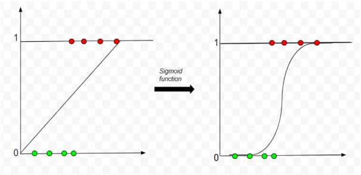
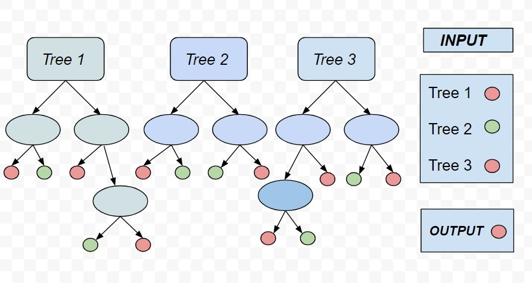
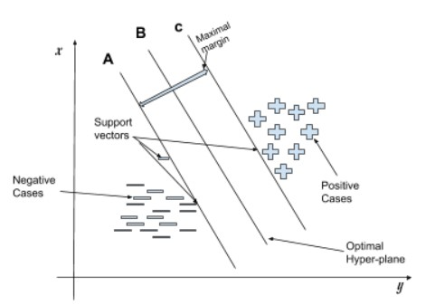
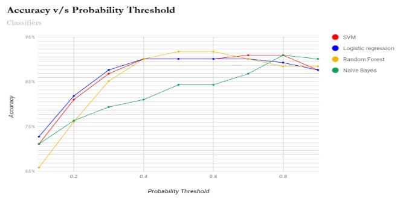
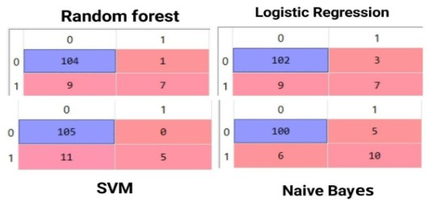

## **Evaluation of Percentage Probability from Clinical features for a Person to be Infected with COVID-19**

In this study, we have predicted the percent probability of a person for being infected with coronavirus with the help of some basic clinical features of their body by applying various machine learning algorithms. This prediction can help us to prioritize our testing to the most prone cases of the corona. We can further test less prone cases by dividing them into small groups and mixing their blood samples together. Thus if a sample tests negative then the whole group of people tests negative and we need not perform any further testing. Thus our model for probability prediction is highly helpful in targeting a better audience for testing as well as reducing the number of possible tests.

### Introduction

Our model works on the prediction of percent probability of a person being infected by COVID-19 and an innovative way of performing the test in an efficient way such that not only all the people are tested but also the use of the test kits are minimized.

### Dataset

This dataset contains anonymized data from &quot;patients seen at the Hospital Israelita Albert Einstein in Brazil&#39;&#39;.The samples were collected to carry out the &quot;SARS-CoV-2 RT-PCR&quot; and additional laboratory tests in the hospital.

These data were anonymized in accordance with proper international enactment and guidance. The clinical data were normalized such that their mean is zero and has a unit standard deviation.

The original dataset consisted of 5644 rows of patients and 111 columns which consisted of clinical features (eg.Hematocrit, Hemoglobin, Platelets etc) including patient ID and test results. Before applying our model to the dataset we cleaned the dataset by removing

rows and columns with very less or no information. Finally, we applied our model with 602 rows of patients and 17 columns which included patient ID and test results.

### Methodology

**A.Cleaning of Data**

Firstly, we deal with missing values by marking them as &#39;NaN&#39; .Now after dividing the dataset into training and test set, we did feature scaling so as to standardize the independent features in a definite range to handle the large variation in data.

### B.Applying Model

**1. Application of Naive Bayes algorithm**

```
x = set of positive cases
y = set of negative cases
```

Let ```t``` be a person to be tested then ```t=f1+ f2+.....+fn```where ```f1, f2,....fn```etc are different clinical features of a person to be tested.

Now for calculating the probability of a particular person to be infected with COVID-19 or not.

```
p(x/t)=p(t/x)*p(t)/p(x)
```

assume &#39; **Naive**&#39; condition _i.e._ every feature in one person&#39;s sample does not have a

dependency on other person&#39;s sample.

Then,

```p(t)=p(f1)*p(f2)*......*p(fn)```

Finally applying Bayes Theorem,

```p(t/x)=p(f1/x)*p(f2/x)*......*p(fn/x)```

**2.Application of Logistic Regression Algorithm**




**Figure 1 Change by Sigmoid Function**


As we can see figure 1 shows the change that occurs after applying the logistic function on the data set and figure 2 shows how the probability threshold works in predicting the percent probability.

.jpg)


**Figure 2 Logistic regression with threshold**


**3.Application of Random Forest Algorithm**



**Figure 3 Random Forest Classification**

**4.Application of Support Vector Machine Algorithm**



**Figure 4: Support Vector Machine Classification**

### Test and Result



| **Accuracy Indexes** | **Random Forest** | **Support Vector Machine** | **Logistic Regression** | **Naive Bayes** |
| --- | --- | --- | --- | --- |
| **Accuracy** | 91.73% | 90.90% | 90.08% | 90.90% |
| **Sensitivity** | 92.03 | 90.51 | 91.89 | 94.43 |
| **Specificity** | 87.50 | 100 | 70.00 | 66.67 |




**Figure 4: Confusion matrices of highest accuracy for different classifications**

### Discussion

For data to be tested, we first run it on our model such that and those who result positive after this are removed from the test data. Thus we have removed those people who are having the probability of more than of being infected with Coronavirus. Now we are left with data of people whose percent probability of being infected is less than or equal to in test data. Now we will again run the test data on our model by keeping the and so on till the so that we could segregate the cases on the basis of different probability thresholds.

Hence we got the cases which are most and least critical. Now we can perform the testing for most critical cases first and for the less critical cases we could divide them into small groups and perform testing by mixing the blood sample of all the people in that group and if that sample tests negative then the whole group tests negative and we need not perform any further testing.It is like performing Binary Search for finding the positive case from that small group.

### Conclusion

Different classification models gave different accuracy for the same dataset. We achieved an accuracy of 90.9% from Naive Bayes and SVM classifiers while 90.8% and 91.73% from Logistic Regression and Random Forest classifiers respectively which can further be improvised when trained on a bigger dataset and with a greater number of clinical features in the dataset.


[1]: https://github.com/sonusingh99
[2]: https://www.linkedin.com/in/sonu-singh-346988152/ 


---
[][1][][2]
---

